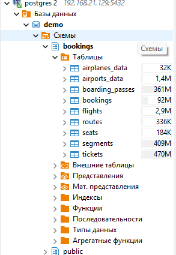
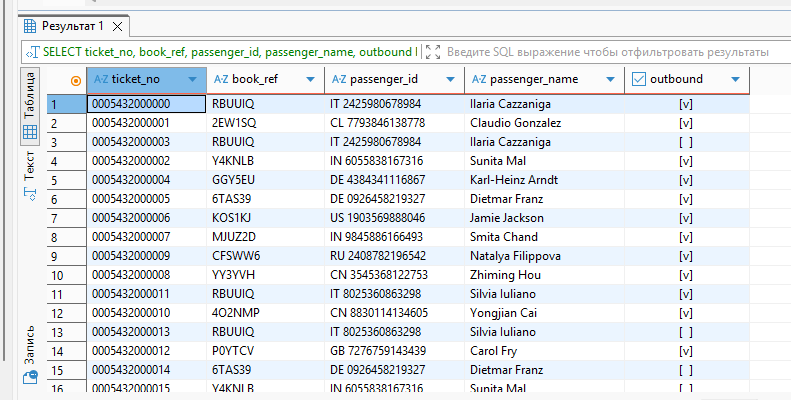
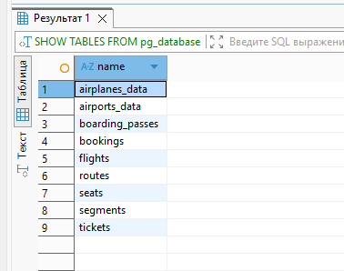
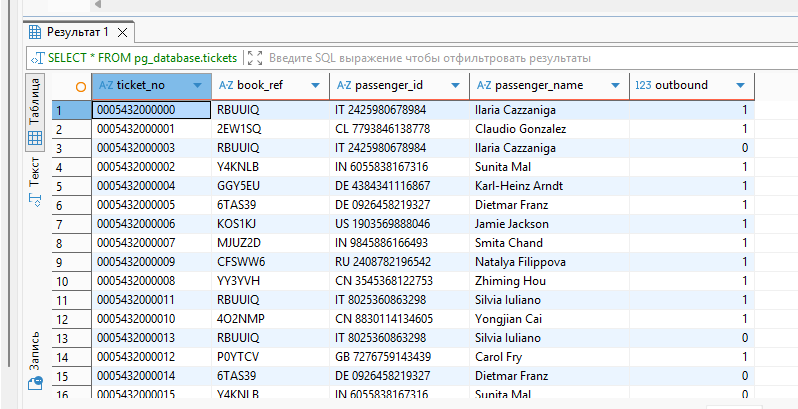

Развертывание postgres в docker:

```
services:
  postgres:
    image: postgres:16
    container_name: postgres
    restart: unless-stopped
    environment:
      POSTGRES_USER: postgres
      POSTGRES_PASSWORD: postgres
      POSTGRES_DB: postgres
    ports:
      - "5432:5432"
    volumes:
      - postgres_data:/var/lib/postgresql/data
    healthcheck:
      test: ["CMD-SHELL", "pg_isready -U postgres -d postgres"]
      interval: 10s
      timeout: 5s
      retries: 5

volumes:
  postgres_data:
```

Загрузка тестового датасета:

```
gunzip -c demo-20250901-3m.sql.gz | psql -U postgres -d postgres
```




Создание таблицы в clickhouse с движком PostgreSQL:

```
CREATE TABLE pg_tickets (
	ticket_no String,
	book_ref String,
	passenger_id String,
	passenger_name String,
	outbound Boolean,
)
ENGINE = PostgreSQL('localhost:5432', 'demo', 'tickets', 'postgres', 'postgres', 'bookings');


SELECT ticket_no, book_ref, passenger_id, passenger_name, outbound
FROM `default`.pg_tickets;
```



Создание БД:

```
CREATE DATABASE pg_database
ENGINE = PostgreSQL('localhost:5432', 'demo', 'postgres', 'postgres', 'bookings');

SHOW TABLES FROM pg_database;

SELECT * FROM pg_database.tickets;
```





