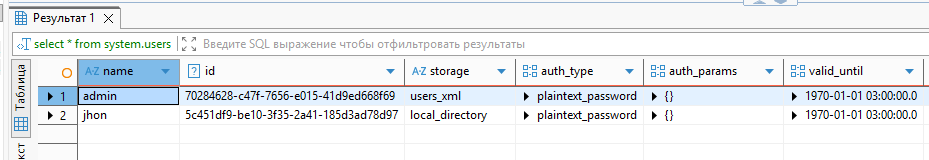
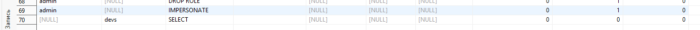
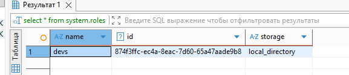

```
create user jhon IDENTIFIED WITH plaintext_password BY 'qwerty';

create role devs;

GRANT SELECT ON *.* TO devs;

GRANT devs TO jhon;

select * from system.users

select  *from system.grants

select * from system.roles
```






