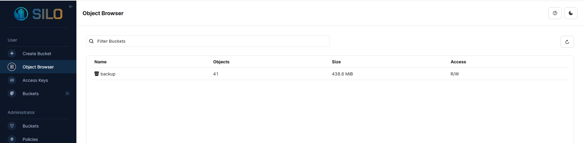
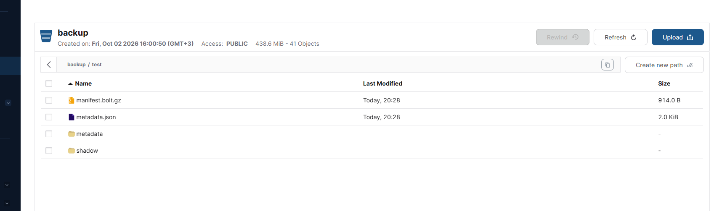
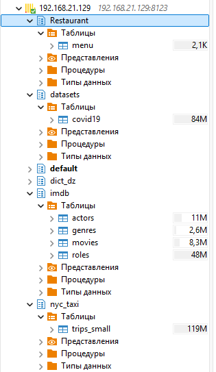
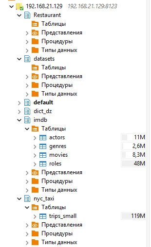
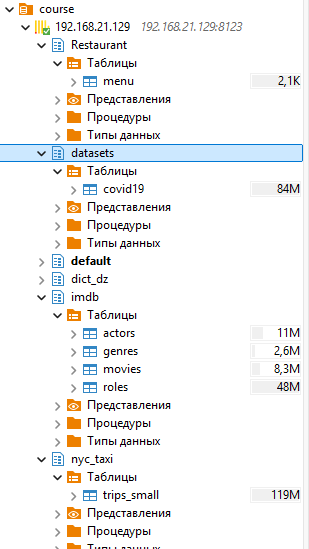

Развернут Minio:



docker-compose.yaml:

```
services:
  minio:
    image: pgsty/minio:latest
    container_name: minio-staging
    restart: unless-stopped
    environment:
      - MINIO_ROOT_USER=${MINIO_ROOT_USER:-minio}
      - MINIO_ROOT_PASSWORD=${MINIO_ROOT_PASSWORD:-miniominio}
    command: server /data --console-address ":19010" --address ":19009"
    volumes:
      - minio-data:/data
    network_mode: host
    healthcheck:
      test: ["CMD", "curl", "-f", "http://localhost:19009/minio/health/live"]
      interval: 10s
      timeout: 5s
      retries: 3
      start_period: 30s

volumes:
  minio-data:
```

Создание бэкапа:

```
clickhouse-backup create_remote test
```



Исходные таблицы:



Удаляю две таблицы:



Выполнение команды по восстановлению:

```
clickhouse-backup restore_remote test
```

Восстановленные таблицы:


