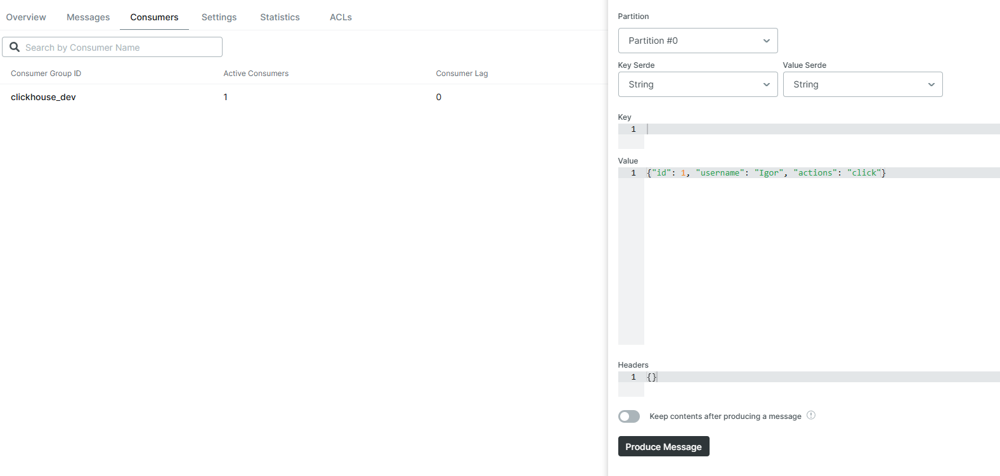
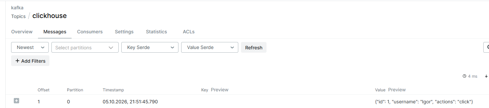
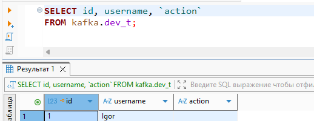

Создание пайплайна для заливки данных из Kafka:

```
create table kafka.dev 
(
id UInt64,
username String,
action LowCardinality(String)
)
engine = Kafka()
SETTINGS
kafka_broker_list = 'localhost:19092,localhost:29092,localhost:39092',
kafka_topic_list = 'clickhouse',
kafka_group_name = 'clickhouse_dev',
kafka_format = 'JSONEachRow'


create table kafka.dev_t
(
id UInt64,
username String,
action LowCardinality(String)
)
engine = MergeTree
order by id

create materialized view kafka.dev_mv to kafka.dev_t
as
select * from kafka.dev
```

Публикация сообщения:



Данные в таблице:



```
select * from system.kafka_consumers
format JSONEachRow
```

```
{"database":"kafka","table":"dev","consumer_id":"ClickHouse-click1-kafka-dev-4763cc3f-d403-4098-a04b-559fbde80700","assignments.topic":["clickhouse"],"assignments.partition_id":[0],"assignments.current_offset":[2],"assignments.intent_size":[null],"exceptions.time":[],"exceptions.text":[],"last_poll_time":"2026-10-05 18:53:21","num_messages_read":2,"last_commit_time":"2026-10-05 18:51:51","num_commits":2,"last_rebalance_time":"1970-01-01 00:00:00","num_rebalance_revocations":0,"num_rebalance_assignments":2,"is_currently_used":1,"last_used":"2026-10-05 18:53:19.581721","rdkafka_stat":"","dependencies":[["kafka.dev_mv","kafka.dev_t"]],"missing_dependencies":[]}
```
