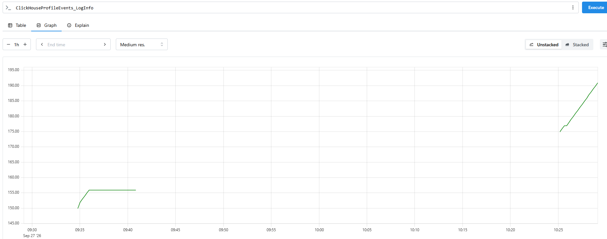
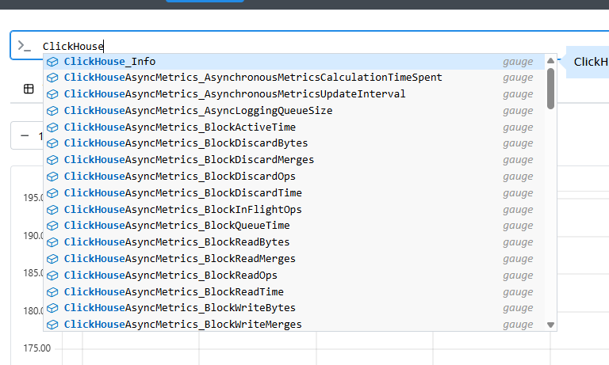

Настроены метрики в clickhouse:

```
<clickhouse>
    <prometheus>
        <endpoint>/metrics</endpoint>
        <port>9363</port>

        <metrics>true</metrics>
        <events>true</events>
        <asynchronous_metrics>true</asynchronous_metrics>
    </prometheus>
</clickhouse>
```

Конфигурация prometheus:

```
global:
  scrape_interval: 15s

scrape_configs:
  - job_name: 'clickhouse'
    static_configs:
      - targets:
          - '192.168.0.101:9363'
        labels:
          cluster: 'my_cluster'
    metrics_path: '/metrics'
```




