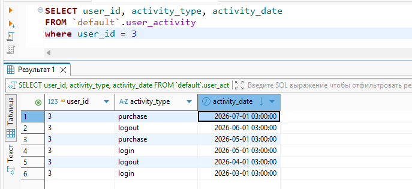
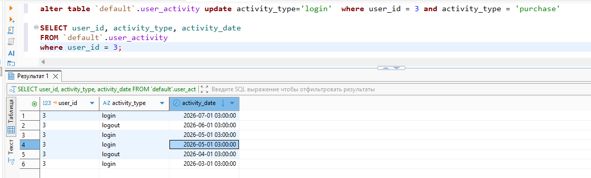
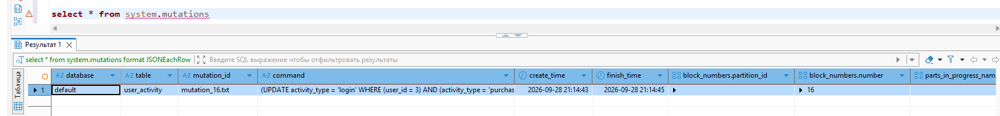
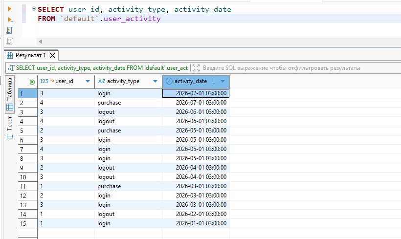
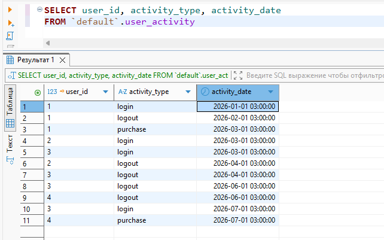

```
create table  user_activity(
user_id UInt32,
activity_type LowCardinality(String),
activity_date DateTime
)
engine = MergeTree
order by user_id
partition by toYYYYMMDD(activity_date)
```

До мутаций:



После мутаций:



Проверка мутаций:



Удаление партиции:

```
alter table `default`.user_activity drop partition '20260501';
```

До удаления:



После удаления:


