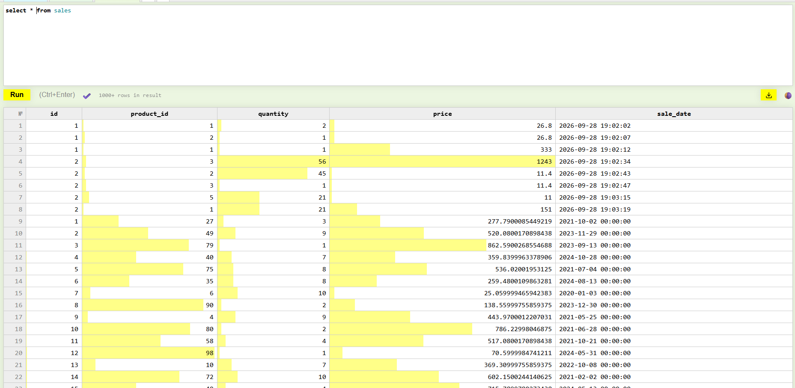
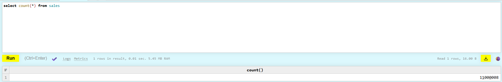
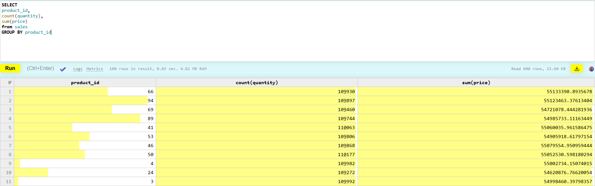
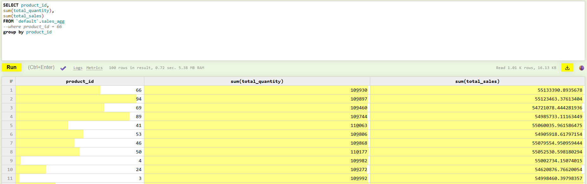

```
CREATE TABLE default.sales
(
    `id` UInt32,
    `product_id` UInt32,
    `quantity` UInt32,
    `price` Float64,
    `sale_date` DateTime,
    PROJECTION product_id_price_quantity
    (
        SELECT
        product_id,
        count(quantity),
        sum(price)
        GROUP BY product_id
    )
)
ENGINE = MergeTree
ORDER BY tuple();

CREATE TABLE default.sales_agg
(
    `product_id` UInt32,
    `total_quantity` UInt32,
    total_sales Float64
 )
ENGINE = MergeTree
ORDER BY tuple();


create materialized view sales_mv to sales_agg
as
        SELECT
        product_id,
        count(quantity) as total_quantity,
        sum(price) as total_sales
        from sales
        GROUP BY product_id;
```





Запрос к проеции:





Запрос к проекции выполняется явно быстрее, чем к таблице, в которую вставлялись данные после материализованного представления. Также важно, что запрос к этой таблице требует доагргации.
