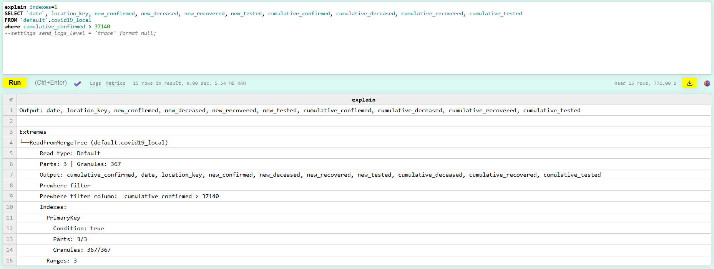
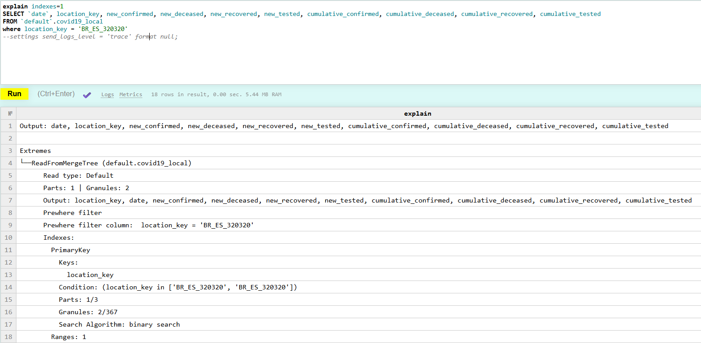
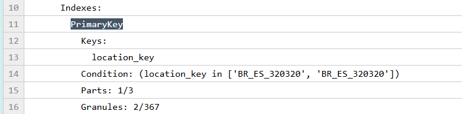

Создаем таблицы на основе датасета:

```
CREATE table covid19_local
(
    date Date,
    location_key LowCardinality(String),
    new_confirmed Int32,
    new_deceased Int32,
    new_recovered Int32,
    new_tested Int32,
    cumulative_confirmed Int32,
    cumulative_deceased Int32,
    cumulative_recovered Int32,
    cumulative_tested Int32
)
ENGINE = MergeTree
ORDER BY (location_key, date)

insert into covid19_local
SELECT *
FROM url('https://storage.googleapis.com/covid19-open-data/v3/epidemiology.csv')
LIMIT 3000000;
```

Запрос без использование первичного индекса в условии WHERE:

```
SELECT `date`, location_key, new_confirmed, new_deceased, new_recovered, new_tested, cumulative_confirmed, cumulative_deceased, cumulative_recovered, cumulative_tested
FROM `default`.covid19_local
where cumulative_confirmed > 37140
settings send_logs_level = 'trace' format null;
```

Лог:

```
[clickhouse-01] 2026-09-27 10:40:10.028583 [ 320 ] {5e1b204c-a900-41a9-a55c-5cc58fe3db01} <Debug> executeQuery: (from 192.168.65.1:63416, user: admin) SELECT `date`, location_key, new_confirmed, new_deceased, new_recovered, new_tested, cumulative_confirmed, cumulative_deceased, cumulative_recovered, cumulative_tested FROM `default`.covid19_local where cumulative_confirmed > 37140 settings send_logs_level = 'trace' format null; (stage: Complete)
[clickhouse-01] 2026-09-27 10:40:10.028978 [ 320 ] {5e1b204c-a900-41a9-a55c-5cc58fe3db01} <Trace> Planner: Query to stage Complete
[clickhouse-01] 2026-09-27 10:40:10.029045 [ 320 ] {5e1b204c-a900-41a9-a55c-5cc58fe3db01} <Debug> MemoryTrackerUtils: Lower number of threads for query to 3 (8 requested)
[clickhouse-01] 2026-09-27 10:40:10.029109 [ 320 ] {5e1b204c-a900-41a9-a55c-5cc58fe3db01} <Trace> Planner: Query from stage FetchColumns to stage Complete
[clickhouse-01] 2026-09-27 10:40:10.029285 [ 320 ] {5e1b204c-a900-41a9-a55c-5cc58fe3db01} <Debug> MemoryTrackerUtils: Lower number of threads for query to 3 (8 requested)
[clickhouse-01] 2026-09-27 10:40:10.029573 [ 320 ] {5e1b204c-a900-41a9-a55c-5cc58fe3db01} <Trace> QueryPlanOptimizePrewhere: The min valid primary key position for moving to the tail of PREWHERE is -1
[clickhouse-01] 2026-09-27 10:40:10.029585 [ 320 ] {5e1b204c-a900-41a9-a55c-5cc58fe3db01} <Trace> QueryPlanOptimizePrewhere: Moved 1 conditions to PREWHERE
[clickhouse-01] 2026-09-27 10:40:10.029675 [ 320 ] {5e1b204c-a900-41a9-a55c-5cc58fe3db01} <Debug> default.covid19_local (0e9fa6ab-babb-4f92-9589-cd6c62922231) (SelectExecutor): Key condition: unknown
[clickhouse-01] 2026-09-27 10:40:10.029731 [ 320 ] {5e1b204c-a900-41a9-a55c-5cc58fe3db01} <Debug> default.covid19_local (0e9fa6ab-babb-4f92-9589-cd6c62922231) (SelectExecutor): Query condition cache has dropped 243/367 granules for PREWHERE condition greater(__table1.cumulative_confirmed, 37140_UInt16).
[clickhouse-01] 2026-09-27 10:40:10.029738 [ 320 ] {5e1b204c-a900-41a9-a55c-5cc58fe3db01} <Debug> default.covid19_local (0e9fa6ab-babb-4f92-9589-cd6c62922231) (SelectExecutor): Query condition cache has dropped 0/124 granules for WHERE condition greater(cumulative_confirmed, 37140_UInt16).
[clickhouse-01] 2026-09-27 10:40:10.029747 [ 320 ] {5e1b204c-a900-41a9-a55c-5cc58fe3db01} <Trace> default.covid19_local (0e9fa6ab-babb-4f92-9589-cd6c62922231) (SelectExecutor): Filtering marks by primary and secondary keys
[clickhouse-01] 2026-09-27 10:40:10.030106 [ 320 ] {5e1b204c-a900-41a9-a55c-5cc58fe3db01} <Debug> default.covid19_local (0e9fa6ab-babb-4f92-9589-cd6c62922231) (SelectExecutor): PK index has dropped 0/124 granules, it took 0ms across 3 threads.
[clickhouse-01] 2026-09-27 10:40:10.030137 [ 320 ] {5e1b204c-a900-41a9-a55c-5cc58fe3db01} <Debug> default.covid19_local (0e9fa6ab-babb-4f92-9589-cd6c62922231) (SelectExecutor): Selected 3/3 parts by partition key, 3 parts by primary key, 124/367 marks by primary key, 124 marks to read from 52 ranges
[clickhouse-01] 2026-09-27 10:40:10.030149 [ 320 ] {5e1b204c-a900-41a9-a55c-5cc58fe3db01} <Trace> default.covid19_local (0e9fa6ab-babb-4f92-9589-cd6c62922231) (SelectExecutor): Spreading mark ranges among streams (default reading)
[clickhouse-01] 2026-09-27 10:40:10.030238 [ 320 ] {5e1b204c-a900-41a9-a55c-5cc58fe3db01} <Debug> default.covid19_local (0e9fa6ab-babb-4f92-9589-cd6c62922231) (SelectExecutor): Reading approx. 1015808 rows with 3 streams
[clickhouse-01] 2026-09-27 10:40:10.108710 [ 320 ] {5e1b204c-a900-41a9-a55c-5cc58fe3db01} <Trace> QueryResultCache: Skipped insert because the query result is too big, query result size: 2 MiB (maximum size: 1 MiB), query result size in rows: 103913 (maximum size: 30000000), query: "SELECT date, location_key, new_confirmed, new_deceased, new_recovered, new_tested, cumulative_confirmed, cumulative_deceased, cumulative_recovered, cumulative_tested FROM default.covid19_local WHERE cumulative_confirmed > 37140 SETTINGS send_logs_level = 'trace' FORMAT `null`"
[clickhouse-01] 2026-09-27 10:40:10.108918 [ 320 ] {5e1b204c-a900-41a9-a55c-5cc58fe3db01} <Debug> executeQuery: Read 1015808 rows, 26.92 MiB in 0.080 sec., 12632071.131 rows/sec., 334.71 MiB/sec.
[clickhouse-01] 2026-09-27 10:40:10.108968 [ 320 ] {5e1b204c-a900-41a9-a55c-5cc58fe3db01} <Debug> MemoryTracker: Query peak memory usage: 13.50 MiB.
```

Запрос с использованием первичного индекса в условии WHERE:

```
SELECT `date`, location_key, new_confirmed, new_deceased, new_recovered, new_tested, cumulative_confirmed, cumulative_deceased, cumulative_recovered, cumulative_tested
FROM `default`.covid19_local
where location_key = 'BR_ES_320320'
settings send_logs_level = 'trace' format null;
```

```
[clickhouse-01] 2026-09-27 10:40:20.496990 [ 320 ] {e529cfba-5b93-4aef-a350-52adf8979a57} <Debug> executeQuery: (from 192.168.65.1:63416, user: admin) SELECT `date`, location_key, new_confirmed, new_deceased, new_recovered, new_tested, cumulative_confirmed, cumulative_deceased, cumulative_recovered, cumulative_tested FROM `default`.covid19_local where location_key = 'BR_ES_320320' settings send_logs_level = 'trace' format null; (stage: Complete)
[clickhouse-01] 2026-09-27 10:40:20.497420 [ 320 ] {e529cfba-5b93-4aef-a350-52adf8979a57} <Trace> Planner: Query to stage Complete
[clickhouse-01] 2026-09-27 10:40:20.497487 [ 320 ] {e529cfba-5b93-4aef-a350-52adf8979a57} <Debug> MemoryTrackerUtils: Lower number of threads for query to 3 (8 requested)
[clickhouse-01] 2026-09-27 10:40:20.497547 [ 320 ] {e529cfba-5b93-4aef-a350-52adf8979a57} <Trace> Planner: Query from stage FetchColumns to stage Complete
[clickhouse-01] 2026-09-27 10:40:20.497708 [ 320 ] {e529cfba-5b93-4aef-a350-52adf8979a57} <Debug> MemoryTrackerUtils: Lower number of threads for query to 3 (8 requested)
[clickhouse-01] 2026-09-27 10:40:20.498052 [ 320 ] {e529cfba-5b93-4aef-a350-52adf8979a57} <Trace> QueryPlanOptimizePrewhere: The min valid primary key position for moving to the tail of PREWHERE is 0
[clickhouse-01] 2026-09-27 10:40:20.498066 [ 320 ] {e529cfba-5b93-4aef-a350-52adf8979a57} <Trace> QueryPlanOptimizePrewhere: Moved 1 conditions to PREWHERE
[clickhouse-01] 2026-09-27 10:40:20.498186 [ 320 ] {e529cfba-5b93-4aef-a350-52adf8979a57} <Debug> default.covid19_local (0e9fa6ab-babb-4f92-9589-cd6c62922231) (SelectExecutor): Key condition: (column 0 in ['BR_ES_320320', 'BR_ES_320320'])
[clickhouse-01] 2026-09-27 10:40:20.498232 [ 320 ] {e529cfba-5b93-4aef-a350-52adf8979a57} <Debug> default.covid19_local (0e9fa6ab-babb-4f92-9589-cd6c62922231) (SelectExecutor): Query condition cache has dropped 0/367 granules for PREWHERE condition equals(__table1.location_key, 'BR_ES_320320'_String).
[clickhouse-01] 2026-09-27 10:40:20.498247 [ 320 ] {e529cfba-5b93-4aef-a350-52adf8979a57} <Debug> default.covid19_local (0e9fa6ab-babb-4f92-9589-cd6c62922231) (SelectExecutor): Query condition cache has dropped 365/367 granules for WHERE condition equals(location_key, 'BR_ES_320320'_String).
[clickhouse-01] 2026-09-27 10:40:20.498264 [ 320 ] {e529cfba-5b93-4aef-a350-52adf8979a57} <Trace> default.covid19_local (0e9fa6ab-babb-4f92-9589-cd6c62922231) (SelectExecutor): Filtering marks by primary and secondary keys
[clickhouse-01] 2026-09-27 10:40:20.498289 [ 320 ] {e529cfba-5b93-4aef-a350-52adf8979a57} <Trace> default.covid19_local (0e9fa6ab-babb-4f92-9589-cd6c62922231) (SelectExecutor): Found continuous range in 2 steps
[clickhouse-01] 2026-09-27 10:40:20.498299 [ 320 ] {e529cfba-5b93-4aef-a350-52adf8979a57} <Debug> default.covid19_local (0e9fa6ab-babb-4f92-9589-cd6c62922231) (SelectExecutor): PK index has dropped 0/2 granules, it took 0ms across 1 threads.
[clickhouse-01] 2026-09-27 10:40:20.498334 [ 320 ] {e529cfba-5b93-4aef-a350-52adf8979a57} <Debug> default.covid19_local (0e9fa6ab-babb-4f92-9589-cd6c62922231) (SelectExecutor): Selected 3/3 parts by partition key, 1 parts by primary key, 2/367 marks by primary key, 2 marks to read from 1 ranges
[clickhouse-01] 2026-09-27 10:40:20.498343 [ 320 ] {e529cfba-5b93-4aef-a350-52adf8979a57} <Trace> default.covid19_local (0e9fa6ab-babb-4f92-9589-cd6c62922231) (SelectExecutor): Spreading mark ranges among streams (default reading)
[clickhouse-01] 2026-09-27 10:40:20.498399 [ 320 ] {e529cfba-5b93-4aef-a350-52adf8979a57} <Trace> default.covid19_local (0e9fa6ab-babb-4f92-9589-cd6c62922231) (SelectExecutor): Reading 1 ranges in order from part all_3_3_0, approx. 16384 rows starting from 229376
[clickhouse-01] 2026-09-27 10:40:20.498584 [ 320 ] {e529cfba-5b93-4aef-a350-52adf8979a57} <Trace> QueryResultCache: Skipped insert because the cache contains a non-stale query result for query "SELECT date, location_key, new_confirmed, new_deceased, new_recovered, new_tested, cumulative_confirmed, cumulative_deceased, cumulative_recovered, cumulative_tested FROM default.covid19_local WHERE location_key = 'BR_ES_320320' SETTINGS send_logs_level = 'trace' FORMAT `null`"
[clickhouse-01] 2026-09-27 10:40:20.528331 [ 320 ] {e529cfba-5b93-4aef-a350-52adf8979a57} <Trace> QueryResultCache: Skipped insert because the cache contains a non-stale query result for query "SELECT date, location_key, new_confirmed, new_deceased, new_recovered, new_tested, cumulative_confirmed, cumulative_deceased, cumulative_recovered, cumulative_tested FROM default.covid19_local WHERE location_key = 'BR_ES_320320' SETTINGS send_logs_level = 'trace' FORMAT `null`"
[clickhouse-01] 2026-09-27 10:40:20.528524 [ 320 ] {e529cfba-5b93-4aef-a350-52adf8979a57} <Debug> executeQuery: Read 16384 rows, 448.00 KiB in 0.032 sec., 517498.421 rows/sec., 13.82 MiB/sec.
[clickhouse-01] 2026-09-27 10:40:20.528555 [ 320 ] {e529cfba-5b93-4aef-a350-52adf8979a57} <Debug> MemoryTracker: Query peak memory usage: 6.34 MiB.
```

Строки, относящиеся к пробегу основного индекса в логах запросов:

```
[clickhouse-01] 2026-09-27 10:49:57.042085 [ 320 ] {d6b4163d-4a00-4e07-ba5f-bb8dbc49a9c3} <Debug> default.covid19_local (0e9fa6ab-babb-4f92-9589-cd6c62922231) (SelectExecutor): Query condition cache has dropped 243/367 granules for PREWHERE condition greater(__table1.cumulative_confirmed, 37140_UInt16).
[clickhouse-01] 2026-09-27 10:49:57.042095 [ 320 ] {d6b4163d-4a00-4e07-ba5f-bb8dbc49a9c3} <Debug> default.covid19_local (0e9fa6ab-babb-4f92-9589-cd6c62922231) (SelectExecutor): Query condition cache has dropped 0/124 granules for WHERE condition greater(cumulative_confirmed, 37140_UInt16).
[clickhouse-01] 2026-09-27 10:49:57.042103 [ 320 ] {d6b4163d-4a00-4e07-ba5f-bb8dbc49a9c3} <Trace> default.covid19_local (0e9fa6ab-babb-4f92-9589-cd6c62922231) (SelectExecutor): Filtering marks by primary and secondary keys
[clickhouse-01] 2026-09-27 10:49:57.042346 [ 320 ] {d6b4163d-4a00-4e07-ba5f-bb8dbc49a9c3} <Debug> default.covid19_local (0e9fa6ab-babb-4f92-9589-cd6c62922231) (SelectExecutor): PK index has dropped 0/124 granules, it took 0ms across 3 threads.
[clickhouse-01] 2026-09-27 10:49:57.042378 [ 320 ] {d6b4163d-4a00-4e07-ba5f-bb8dbc49a9c3} <Debug> default.covid19_local (0e9fa6ab-babb-4f92-9589-cd6c62922231) (SelectExecutor): Selected 3/3 parts by partition key, 3 parts by primary key, 124/367 marks by primary key, 124 marks to read from 52 ranges
```

В первом случае пропущено намного меньше гранул, что показывает неэффективный поиск

```
[clickhouse-01] 2026-09-27 10:50:45.243731 [ 320 ] {9c39e126-7b74-4243-b794-f0c216084318} <Debug> default.covid19_local (0e9fa6ab-babb-4f92-9589-cd6c62922231) (SelectExecutor): Query condition cache has dropped 0/367 granules for PREWHERE condition equals(__table1.location_key, 'BR_ES_320320'_String).
[clickhouse-01] 2026-09-27 10:50:45.243744 [ 320 ] {9c39e126-7b74-4243-b794-f0c216084318} <Debug> default.covid19_local (0e9fa6ab-babb-4f92-9589-cd6c62922231) (SelectExecutor): Query condition cache has dropped 365/367 granules for WHERE condition equals(location_key, 'BR_ES_320320'_String).
[clickhouse-01] 2026-09-27 10:50:45.243751 [ 320 ] {9c39e126-7b74-4243-b794-f0c216084318} <Trace> default.covid19_local (0e9fa6ab-babb-4f92-9589-cd6c62922231) (SelectExecutor): Filtering marks by primary and secondary keys
[clickhouse-01] 2026-09-27 10:50:45.243771 [ 320 ] {9c39e126-7b74-4243-b794-f0c216084318} <Trace> default.covid19_local (0e9fa6ab-babb-4f92-9589-cd6c62922231) (SelectExecutor): Found continuous range in 2 steps
[clickhouse-01] 2026-09-27 10:50:45.243780 [ 320 ] {9c39e126-7b74-4243-b794-f0c216084318} <Debug> default.covid19_local (0e9fa6ab-babb-4f92-9589-cd6c62922231) (SelectExecutor): PK index has dropped 0/2 granules, it took 0ms across 1 threads.
[clickhouse-01] 2026-09-27 10:50:45.243794 [ 320 ] {9c39e126-7b74-4243-b794-f0c216084318} <Debug> default.covid19_local (0e9fa6ab-babb-4f92-9589-cd6c62922231) (SelectExecutor): Selected 3/3 parts by partition key, 1 parts by primary key, 2/367 marks by primary key, 2 marks to read from 1 ranges
```

Во втором случае поиск произведен только по двум гранулам из 367


Планировщик запросов:





Во втором случае явно видно использование первичного индекса


