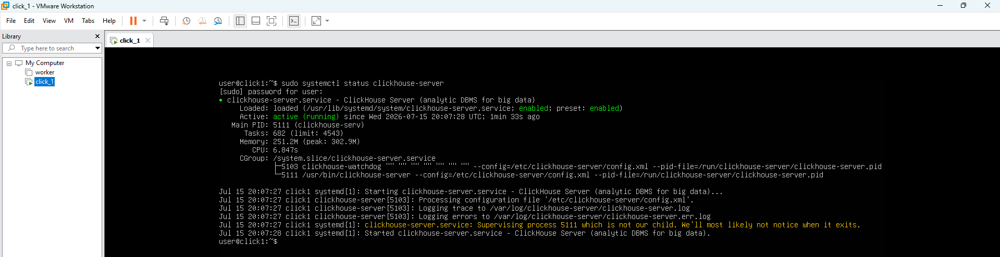
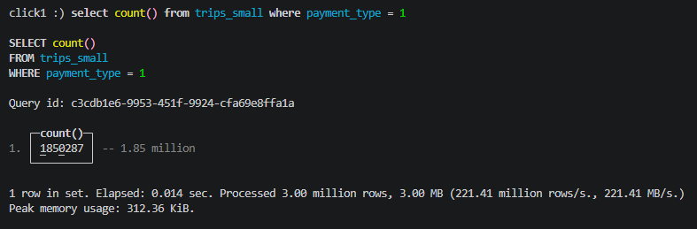

ClickHouse установлен на локальной виртуальной машине в среде VMware Workstation.

Параметры ВМ:

* CPU - 2
* RAM - 4GB
* Hard Disk - 60GB
* OS - Ubuntu 24.04.4 LTS

Установка производилось из deb-пакетов официального репозитория ClickHouse:

```**sudo**
sudo apt-get install -y clickhouse-server clickhouse-client
```

Запущен в качестве службы:

```
sudo systemctl enable clickhouse-server
sudo systemctl daemon-reload
sudo systemctl status clickhouse-server
```

Скриншот ВМ и запущенного инстанса ClickHouse:



Скриншот результата выполнения запроса:



**Тестирование производительности**

Запросы для тестирования:

```
select sum(total_amount) from nyc_taxi.trips_small;
select trip_id from nyc_taxi.trips_small limit 100000;
select count() from nyc_taxi.trips_small;
select trip_id from nyc_taxi.trips_small group by trip_id order by trip_id;
select pickup_ntaname, payment_type, count() from nyc_taxi.trips_small group by pickup_ntaname, payment_type order by pickup_ntaname;

```

Команда для тестирования:

```clickhouse-benchmark
clickhouse-benchmark --host=localhost --port=9000 --user default --password 1 < queries.txt -i 200 --delay 0 -c 3
```

*Результаты первичного тестирования:*

```
Loaded 5 queries.

Queries executed: 200 (100%).

localhost:9000, queries: 200, QPS: 4.427, RPS: 8143949.107, MiB/s: 25.999, result RPS: 2745828.162, result MiB/s: 10.482.

0%              0.001 sec.
10%             0.004 sec.
20%             0.006 sec.
30%             0.008 sec.
40%             0.033 sec.
50%             0.069 sec.
60%             0.236 sec.
70%             0.856 sec.
80%             1.244 sec.
90%             2.328 sec.
95%             2.653 sec.
99%             2.893 sec.
99.9%           4.889 sec.
99.99%          4.889 sec.
```

Измененные настройки:

```
max_server_memory_usage_to_ram_ratio=0.8
```

поскольку памяти на виртуальной машине очень мало, настройку уменьшил с 0.9 до 0.8, чтобы ОС оставалось больше доступной памяти и она не убивала процесс CH.

Увеличение настройки `max_treads` не улучшило скорость выполнения запросов.

Также была мысль посмотреть в сторону настроек: `max_bytes_ratio_before_external_group_by` и `max_bytes_ratio_before_external_sort`, чтобы агрегационные запросы и сортировки не "съедали" всю память, но было выяснено, что по-умолчанию они установлены в 0.5, поэтому менять их не пришлось.

После примененных настроек результаты тестирования следующие:

```
Queries executed: 200 (100%).

localhost:9000, queries: 200, QPS: 4.621, RPS: 8500363.586, MiB/s: 27.137, result RPS: 2865997.493, result MiB/s: 10.941.

0%              0.001 sec.
10%             0.002 sec.
20%             0.005 sec.
30%             0.008 sec.
40%             0.028 sec.
50%             0.065 sec.
60%             0.199 sec.
70%             0.825 sec.
80%             1.253 sec.
90%             2.104 sec.
95%             2.553 sec.
99%             2.943 sec.
99.9%           2.971 sec.
99.99%          2.971 sec.
```

Результат практически не изменился.
