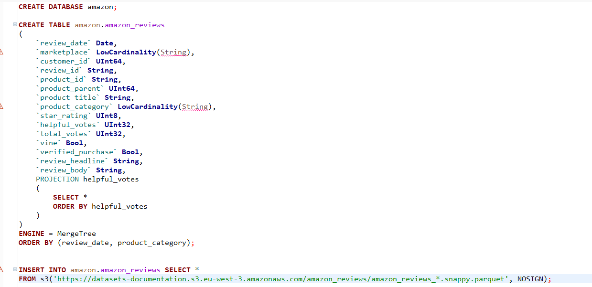
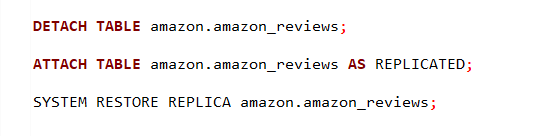
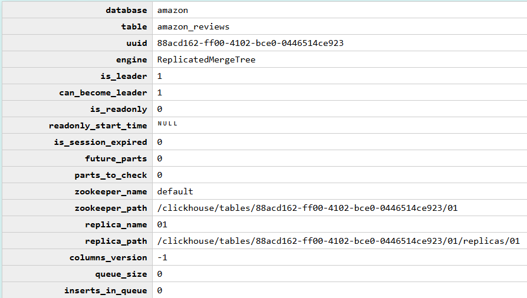
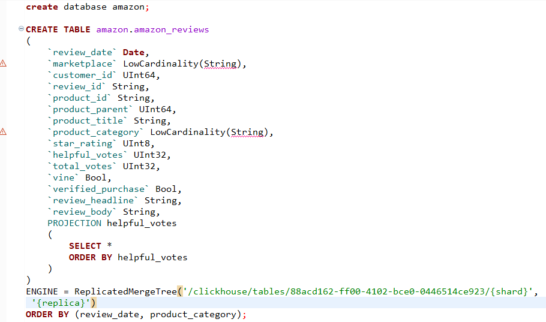
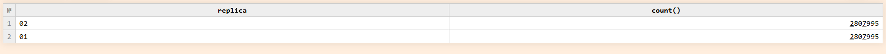
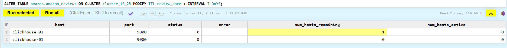
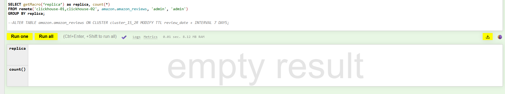

1. Возьмите любой демонстрационный DATASET:

https://clickhouse.com/docs/get-started/sample-datasets/amazon-reviews



2. Конвертируйте таблицу в реплицируемую, используя макрос replica.



3. Добавьте 2 реплики.

* на первом сервере выполняю запрос для поиска uuid, чтобы вставить в параметры движка ReplicatedMergeTree на втором сервере:

```
select * from system.replicas;
```



* создаю таблицу на втором сервере:



4. Выполните запросы и отдайте результаты как 2 файла:

```
SELECT getMacro(‘replica’) as replica, * FROM remote('clickhouse-01,clickhouse-02', system.parts, 'admin', 'admin')
FORMAT JSONEachRow;

SELECT * FROM system.replicas FORMAT JSONEachRow;
```

файлы: remote.json, replicas.json

5. Добавьте или выберите колонку с типом Date в таблице, добавьте TTL на таблицу «хранить последние 7 дней».

* кол-во строк до изменения ttl:

```
SELECT getMacro(‘replica’) as replica, count(*) 
FROM remote('clickhouse-01,clickhouse-02', amazon.amazon_reviews, 'admin', 'admin')
GROUP BY replica
```



* изменение ttl:

```
ALTER TABLE amazon.amazon_reviews ON CLUSTER cluster_1S_2R MODIFY TTL review_date + INTERVAL 7 DAYS;
```




* кол-во строк после изменения ttl:


